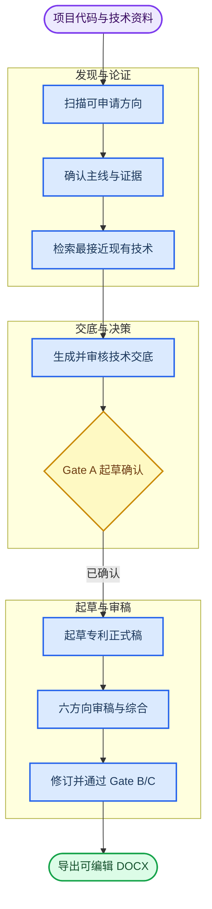

# patents-workflow

_把中文发明专利起草，从一次性提示词变成可恢复、可校验、可交接的完整工作流。_

_A deterministic Agent Skill workflow for drafting, reviewing, and delivering Chinese invention patents._

[](https://github.com/hxhx-win/patents-workflow/releases)
[](https://github.com/hxhx-win/patents-workflow/actions/workflows/ci.yml)
[](LICENSE)
[](#兼容性)

[快速开始](#-五分钟快速开始) · [工作流程](#-完整工作流) · [核心能力](#-为什么使用-patents-workflow) · [参与开发](#-参与开发)

`patents-workflow` 是一套面向中文发明专利的 Agent Skills。它把方向发现、主线分析、现有技术检索、技术交底、正式稿起草、代理师审稿和 DOCX 交付串成一条有状态的流程。关键节点由 Domain Runtime 校验，宿主 Agent 负责理解资料、调用专业 Skill，并在需要决策时把控制权交还给用户。

当前版本：`2.1.0`

## 🎯 为什么使用 patents-workflow

| 能力 | 带来的变化 | 实现依据 |
| --- | --- | --- |
| **完整专利闭环** | 从项目资料走到可编辑 DOCX，不必手工拼接多套提示词 | 9 个核心专利 Skill 覆盖发现、分析、检索、起草、审稿和导出 |
| **确定性流程控制** | 阶段是否可进入、何时退出、下一步做什么，都有明确规则 | Domain Runtime 负责路由、阶段校验和受控状态迁移 |
| **可恢复、可交接** | 长流程中断后可继续，也能在研发与专利协作方之间交接 | `patent/<slug>/state/patent-iteration-state.json` 保存流程状态 |
| **关键决策不过门不推进** | 主线、修改范围和最终交付都需要明确确认 | Gate A、Gate B、Gate C 分别约束起草、修订和交付 |
| **结构化代理师审稿** | 正式稿先按专业方向拆开审查，再汇总成可执行修改意见 | 6 个方向审稿 Agent + 1 个综合 Agent |

## 🗺️ 完整工作流



流程不是一条自动跑到底的黑盒。发明方向、起草策略、审稿意见取舍和最终交付授权仍由用户决定；Runtime 只保证步骤按既定规则推进。

## 🚀 五分钟快速开始

### 1. 下载完整发行包

从 [GitHub Releases](https://github.com/hxhx-win/patents-workflow/releases) 下载同一版本的两个文件：

```text
patents-workflow-v2.1.0-full.zip
patents-workflow-v2.1.0-full.zip.sha256
```

请使用命名的 `full.zip`。GitHub 自动生成的 Source code 压缩包面向贡献者，不是整理后的用户安装包。

### 2. 核对 SHA-256

PowerShell：

```powershell
Get-FileHash .\patents-workflow-v2.1.0-full.zip -Algorithm SHA256
Get-Content .\patents-workflow-v2.1.0-full.zip.sha256
```

Linux 或 macOS：

```bash
sha256sum -c patents-workflow-v2.1.0-full.zip.sha256
```

### 3. 安装并校验

解压后进入 `patents-workflow-2.1.0/`。安装器默认面向 Codex 的 `~/.codex/skills`；第一条命令只预览，第二条才会写入文件：

```bash
python scripts/install-skills.py install
python scripts/install-skills.py install --apply
python scripts/install-skills.py verify
```

### 4. 开始专利流程

在安装了 Skills 的 Agent 中直接描述任务，例如：

```text
请扫描当前项目中可申请中文发明专利的方向，并在我确认后进入完整专利流程。
```

如果已有未完成状态，可以继续上次工作：

```text
继续 patent/<slug>/state/patent-iteration-state.json 中未完成的专利流程。
```

## 🧩 它如何工作

| 层次 | 负责什么 | 不负责什么 |
| --- | --- | --- |
| **宿主 Agent** | 理解用户意图、加载 Skill、调用工具、创建子 Agent、询问用户 | 不自行跳过 Runtime 的阶段校验 |
| **Domain Runtime** | 查询状态、校验阶段、计算下一动作、原子更新流程控制字段 | 不运行 LLM，不代替用户做专业决策 |
| **专业 Skill** | 分析技术资料，执行检索、起草、审稿和导出 | 不复制或改写全局状态机规则 |

这种分工把需要推理的专业工作留给 Agent，同时把流程推进收敛为可检查的状态迁移。

## 📦 包含哪些 Skill

完整发行包包含 9 个核心专利 Skill。

| 阶段 | Skill | 用途 |
| --- | --- | --- |
| 发现与分析 | `cn-patent-repo-scout` | 从项目和技术资料中发现可申请方向 |
| 发现与分析 | `cn-patent-mainline-analysis` | 整理保护路径、技术特征和证据矩阵 |
| 发现与分析 | `cn-patent-prior-art-search` | 检索现有技术并提取可主张区别特征 |
| 交底与审核 | `cn-patent-disclosure-draft` | 执行起草前评审并生成技术交底书 |
| 交底与审核 | `cn-patent-disclosure-review` | 引导发明人审核交底初稿并收集反馈 |
| 起草与交付 | `cn-patent-formal-drafting` | 生成 DOCX-ready 中文专利 Markdown 正式稿 |
| 起草与交付 | `cn-patent-attorney-review` | 从代理师视角审稿并支持多轮修订 |
| 起草与交付 | `cn-patent-docx-export` | 生成可编辑 DOCX 和可选官方模块分片稿 |
| 流程控制 | `cn-patent-domain-runtime` | 提供确定性路由、校验和状态迁移 |

<details>
<summary><strong>查看 6 个附图与文档支撑 Skill</strong></summary>

- `seaborn`
- `scientific-visualization`
- `scientific-schematics`
- `matplotlib`
- `markdown-mermaid-writing`
- `generate-image`

这些 vendored Skill 用于专利附图、数据可视化、技术示意图和 Markdown 文档表达。来源、目录摘要和许可证记录在 [第三方声明](THIRD_PARTY_NOTICES.md) 中。

</details>

---

## 🔒 可检查的流程与发行包

- 状态文件记录当前阶段、关键决策和待处理问题，流程可以从中断处继续
- Gate A/B/C 分别约束正式起草、审稿后修订和最终交付
- Runtime 使用锁和原子替换写入受控状态，避免把并发冲突静默覆盖
- 安装器默认 dry-run，并通过安装收据检查版本、文件集合和内容哈希
- Release 同时提供 ZIP 和 SHA-256；vendored Skill 保留来源和许可证记录

CI 在 Windows 和 Ubuntu 上运行发布检查、单元测试和发行包试构建。

## ⚙️ 进阶安装

### Claude Code

```bash
python scripts/install-skills.py install --agent claude
python scripts/install-skills.py install --agent claude --apply
python scripts/install-skills.py verify --agent claude
```

### 自定义 Skills 目录

```bash
python scripts/install-skills.py install --target-root "<path-to-skills>"
python scripts/install-skills.py install --target-root "<path-to-skills>" --apply
```

### 覆盖安装

目标中已有真实 Skill 目录时，安装器默认整体拒绝。确认直接更新且无需持久备份后，可显式覆盖：

```bash
python scripts/install-skills.py install --apply --overwrite
```

安装器始终拒绝覆盖 symlink、junction 或其他 reparse point。源码开发使用的 live-link 工作流见 [贡献指南](CONTRIBUTING.md)。

### 卸载

卸载同样默认只预览：

```bash
python scripts/install-skills.py uninstall
python scripts/install-skills.py uninstall --apply
```

如果已安装 Skill 有任何修改、增删文件或哈希变化，安装器会整体拒绝自动卸载，以免删除用户内容。校验和卸载应使用与安装版本相同的发行包。

## 🤖 兼容性

| 环境 | 默认安装目录 | 状态 |
| --- | --- | --- |
| Codex | `~/.codex/skills` | 安装器直接支持 |
| Claude Code | `~/.claude/skills` | 通过 `--agent claude` 支持 |
| 其他 Agent Skills 目录 | 用户指定路径 | 通过 `--target-root` 安装 |

安装器仅使用 Python 标准库。项目 CI 使用 Python 3.11，并在 Windows 和 Ubuntu 上验证发行流程。

## ⚠️ 使用边界

本项目辅助整理技术资料、检索现有技术、起草和审查专利材料，不替代执业专利代理师或法律意见。现有技术检索的覆盖范围受可访问数据源和检索条件影响。

提交申请前，请人工复核技术事实、权利要求、附图和检索结论。未公开的代码、技术方案和商业信息应按所在组织的保密规则处理。

## 🤝 参与开发

源码开发、live link、提交前检查和版本发布流程见 [CONTRIBUTING.md](CONTRIBUTING.md)。安全问题请按 [SECURITY.md](SECURITY.md) 中的方式私下报告。

项目自有内容采用 [MIT License](LICENSE)。第三方 Skill 的来源、目录摘要和许可证见 [THIRD_PARTY_NOTICES.md](THIRD_PARTY_NOTICES.md) 与 [`third_party/`](third_party/)。
