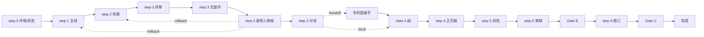

# 中文发明专利 Domain Runtime

为宿主 Agent 提供完整专利流程的确定性路由、校验和受控状态迁移。Runtime 不直接运行 LLM、创建子 Agent、调用专业工具或代替宿主执行 `must_load`；具体规则见下方 reference + scripts。

## 入口边界

- 不扫描项目；无明确方向先用 `cn-patent-repo-scout`
- 只做保护路径设计或特征分层用 `cn-patent-mainline-analysis`
- 已选主线只起草正式稿用 `cn-patent-formal-drafting`

## 阶段总图

## 阶段执行者

| 阶段 | 执行者 | 派 subagent |
|---|---|---|
| 1/2/3 评审/3 交底/4/6 | 对应子 skill | 是 (N0 纪律) |
| 3 发明人审核 | `cn-patent-disclosure-review` | 否（主跑型） |
| 0/Gate A/handoff/分流/5/7/8/9 | 宿主 Agent | 否 |

详见 [references/agent-tool-mapping.md](references/agent-tool-mapping.md)。

## 必读 reference (3 份)

- [references/orchestration-philosophy.md](references/orchestration-philosophy.md)：协作哲学（为什么）
- [references/state-machine-reference.md](references/state-machine-reference.md)：状态机入口（怎么查）
- [references/agent-tool-mapping.md](references/agent-tool-mapping.md)：N0 派单契约

## 脚本入口

- `scripts/domain-runtime.py status|validate|transition`：统一 Runtime CLI；新调用优先使用此入口
- `scripts/validate-stage.py --state-path X --stage S --mode enter|exit`：断言前置/出口
- `scripts/get-next-step.py --state-path X`：计算下一步
- `scripts/handoff-package.py` / `handoff-pickup.py`：交接

## 脚本调用纪律（硬约束）

- 宿主进入新 stage 前 → 跑 `domain-runtime.py validate --mode enter`；返回 `ok=false` 则必须停下补料或询问用户
- subagent 返回 / stage 完成后 → 跑 `domain-runtime.py validate --mode exit`；返回 `ok=false` 则必须补派或追问
- exit 通过后由宿主调用 `domain-runtime.py transition --from-stage S --to-stage T`；禁止宿主直接改 `state.current_stage`
- Runtime 在锁内复核来源阶段、前置/出口条件和推导目标，并原子写入流程控制字段
- **不得凭用户原始请求范围（如"只生成交底书"）提前结束循环**：状态机推进由 Runtime 的 `next_action` 决定，返回 `"completed"` 才算终止
- **按 Runtime 响应的 `executor_info` 决定下一步动作**：`type=main_run_skill` 必须先 Read `must_load` 列表里的文件再继续；`do_not_merge_user_questions=true` 时禁止合并多档 AskUserQuestion
- **step 0 出口附加**：把 `env-check.json` 的 `warnings` 数组逐条在对话中 echo 给用户（字体缺失、缺工具等），避免下游 docx 阶段才暴露
- Runtime 只返回任务契约；宿主 Agent 负责加载 Skill、创建子 Agent、执行工具、用户交互和专业结果回写

## Gate

- Gate A：起草前决策完成 + 用户确认进起草
- Gate B：审稿意见 + 用户反馈双方就位
- Gate C：质量检查通过 + 用户授权交付

## 状态与脚本

- 状态文件：`patent/<patent-slug>/state/patent-iteration-state.json`
- 模板：[assets/patent-iteration-state.template.json](assets/patent-iteration-state.template.json)
- 历史兼容（旧 state 缺新字段）：`scripts/new-iteration-state.py --migrate-from <old.json>`

## 子 skill 引用

- 前置可选：`cn-patent-repo-scout`
- 必要前置：`cn-patent-mainline-analysis` / `cn-patent-prior-art-search` / `cn-patent-disclosure-draft` / `cn-patent-disclosure-review` / `cn-patent-formal-drafting` / `cn-patent-attorney-review`
- 关联可选：`cn-patent-docx-export`（Gate C 通过后导出）
